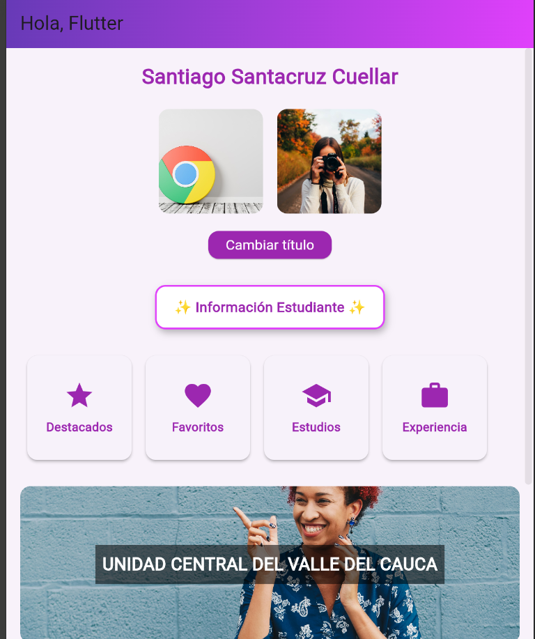

Santiago Alejandro Santacruz Cuellar 
Codigo 230222033

            Taller 1

En este taller se desarrolló una aplicación móvil básica utilizando Flutter, cumpliendo con los requisitos técnicos solicitados. Se creó una pantalla principal con un AppBar cuyo título cambia dinámicamente mediante el uso de setState() y un ElevatedButton, mostrando además un SnackBar de confirmación. En el cuerpo de la aplicación se organizó un diseño visual con Column, incluyendo un texto centrado con el nombre del estudiante, un Row con dos imágenes (una cargada desde la red con Image.network() y otra desde los recursos locales con Image.asset()), y widgets adicionales como Container con estilos y un ListView para mostrar elementos adicionales. También se implementaron elementos de diseño como Padding, SizedBox y alineaciones para mejorar la estética y cumplir con la estructura solicitada.

flutter run
git add .
git commit -m "entrega taller"
git push -u origin feacture-taller1

Imagenes finales

